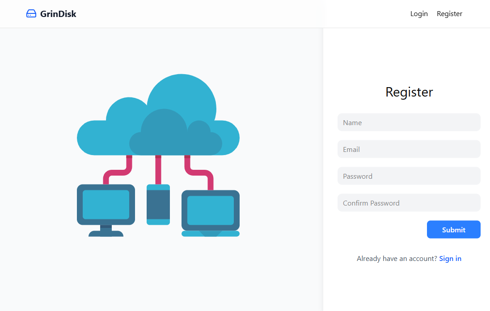
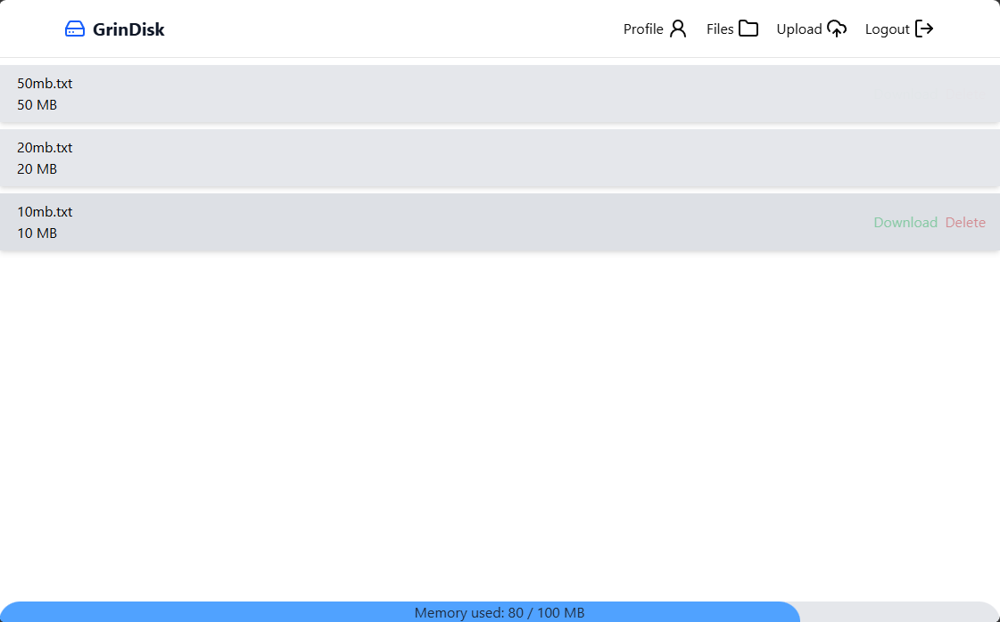
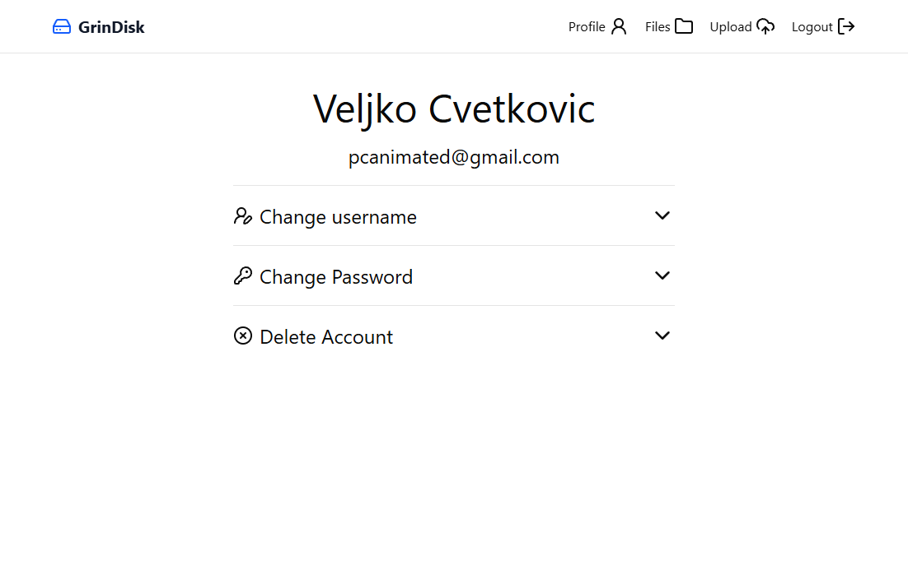
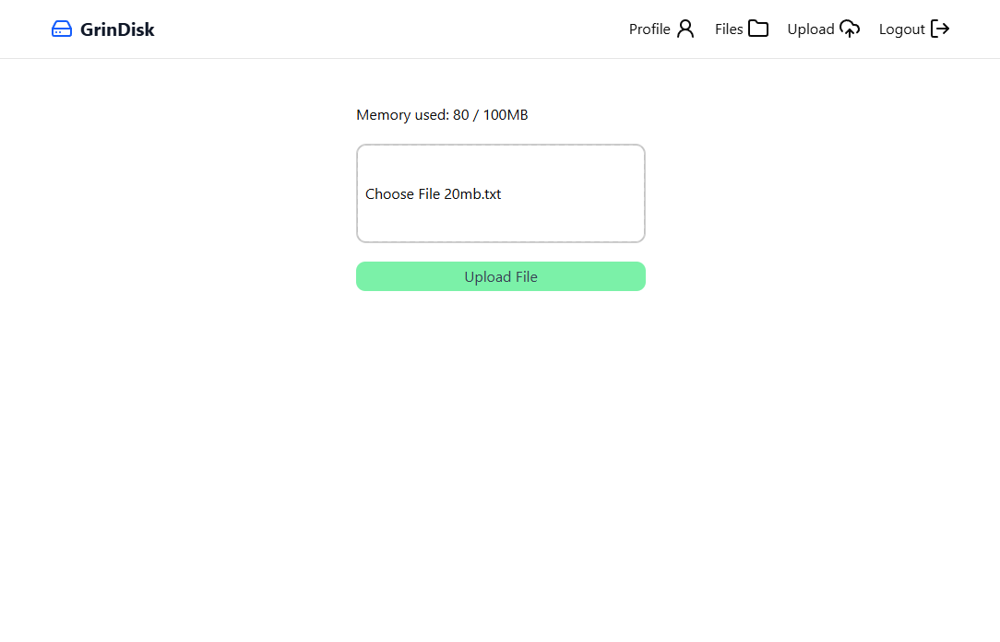

# GrinDisk

GrinDisk is a full-stack file storage system built as a final graduation project.
It allows uploading, managing, and organizing files through a backend API and a frontend interface.

---

## Project Info

This project was developed as a **final graduation project**, demonstrating:

* Backend API development (Express)
* Frontend integration (Vite)
* File storage handling
* Authentication with JWT
* Docker-based deployment

---

## Getting Started

1. Clone the project
```bash
git clone https://github.com/grinarica/GrinDisk.git
```

2. Run it in docker
```bash
docker compose up --build
```

---

## Environment Variables

### Backend (`.env`)

```env
EXPRESS_PORT=7474
PRODUCTION_MODE=false
UPLOADED_PATH=./storage/

DB_URI=mongodb://database:27017/grindisk

JWT_SECRET=your_jwt_secret
REFRESH_TOKEN=your_refresh_token
```

---

### Frontend (`.env`)

```env
VITE_API_URL=http://localhost:7474
```

---

# 100% hand-written project. No AI used.

---

## Screnshots





See more in screenshots folder
